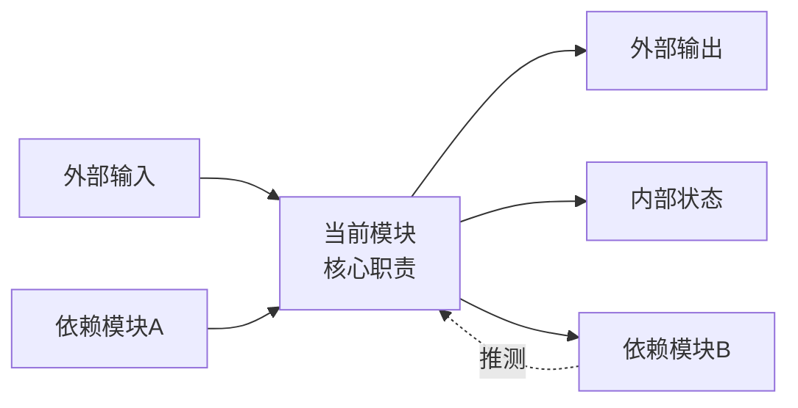
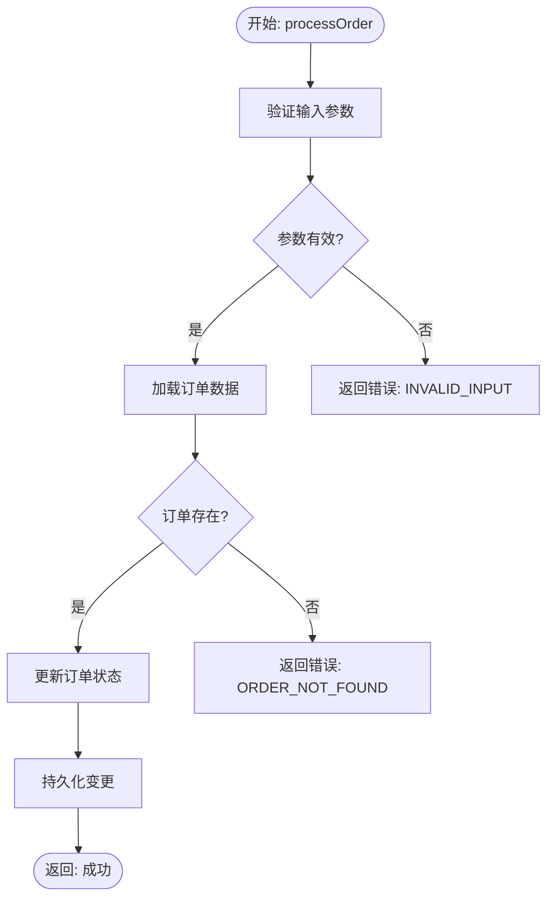
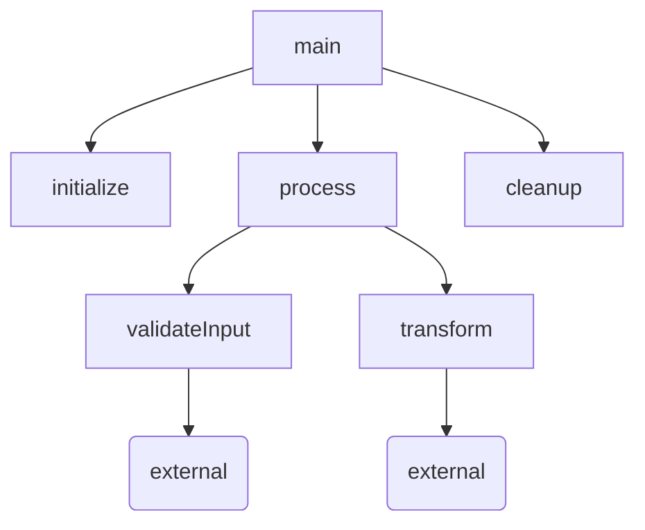

# Atlas 输出结构参考文档

> 本文档是 atlas 子技能 SKILL.md 的权威参考。定义了 semantic atlas 输出的全部 14 个 section 的字段规格和生成规则。
>
> SKILL.md 在生成 atlas 时，应参照本文档中的字段定义、格式要求和生成条件来填充模板。

---

## 总则

### 输出结构

atlas 输出固定为 Section 0–13，共 14 个 section。每个 section 有独立格式（Mermaid 图 / 表格 / 文本）。

### 优先级

**图 > 表 > 文本。** 当信息可以同时用图和表表达时，优先生成图。

### 空值规则

- 表格中所有列必须填写，不允许空单元格。如无法确定则填写 `N/A` 或 `无法判断`。
- Mermaid 图中不确定的依赖/调用关系必须标注 `推测`。

### 语言

- 中文叙述 + 英文技术术语（函数名、类型名、变量名保持原样）。

---

## Section 0: 一屏摘要 Dashboard

### 目的

提供整个分析目标的鸟瞰视图，一行一个文件，让读者在 10 秒内理解代码库的全貌。

### 格式

表格

### 必填字段

| 字段 | 定义 |
|------|------|
| **文件** | 源文件的相对路径（相对于项目根目录） |
| **语言** | 文件使用的编程语言（如 TypeScript、Python、Go） |
| **文件职责** | 一句话概括该文件的核心职责 |
| **核心输入** | 该文件接收的主要数据/参数/事件 |
| **核心输出** | 该文件产出的主要数据/返回值/事件 |
| **关键状态** | 该文件维护的关键状态变量名称 |
| **主要函数** | 列出 2–5 个该文件最重要的函数名 |
| **状态复杂度** | 状态管理的复杂程度：高 / 中 / 低 |
| **副作用复杂度** | 副作用（I/O、网络、文件）的复杂程度：高 / 中 / 低 |
| **主要风险** | 一句话描述该文件最突出的风险点 |
| **需求符合性** | 完全符合 / 部分符合 / 不符合 / 无法判断 |
| **最终风险等级** | 综合 state + side-effect 风险：高 / 中 / 低 |

### 生成规则

1. 每个被分析的源文件占一行。
2. 按模块/目录分组，组间留空行。
3. 所有 12 列必须填写，不允许留空。
4. 状态复杂度和副作用复杂度基于 Section 6 和 Section 8 的分析结果判定。
5. 最终风险等级取状态复杂度和副作用复杂度中的较高者。

---

## Section 1: 模块框架图

### 目的

展示模块间的静态依赖关系，帮助读者快速理解代码组织结构。

### 格式

Mermaid `flowchart LR`

### 必须包含的元素

| 元素 | 说明 |
|------|------|
| **当前文件/类（中心节点）** | 正在被分析的文件或类，放置在图的中心位置 |
| **输入** | 从外部进入当前模块的数据/依赖 |
| **输出** | 当前模块向外部提供的数据/接口 |
| **状态** | 当前模块维护的状态 |
| **依赖** | 当前模块依赖的其他模块/库 |

### 生成规则

1. 使用 `flowchart LR`（从左到右）布局。
2. 每个节点标注核心职责（放在方括号 `[]` 或圆括号 `()` 中）。
3. 边标注关系类型：`调用`、`数据传递`、`import`、`继承` 等。
4. **不确定的依赖关系必须标注 `推测`。**
5. 外部依赖（标准库、第三方库）用虚线或不同颜色标注。

### 示例结构



---

## Section 2: 核心执行流程图

### 目的

展示核心函数内部的执行路径，包括分支、循环、错误处理和返回。

### 格式

Mermaid `flowchart TD`

### 适用范围

仅对名称匹配以下模式的函数生成：
`compute`、`run`、`process`、`update`、`handle`、`execute`、`control`、`main`、`render`、`build`、`transform`、`validate`、`parse`、`dispatch`，以及构造函数。

### 必须包含的元素

| 元素 | 说明 |
|------|------|
| **分支** | 所有 if/else/switch/early return 路径 |
| **状态更新** | 对状态变量的写入操作 |
| **错误路径** | 异常捕获、错误码返回、fallback 逻辑 |
| **返回** | 函数的所有出口点（return、throw、yield） |

### 生成规则

1. 使用 `flowchart TD`（从上到下）布局。
2. 入口节点使用 `([开始: 函数名])` 格式。
3. 条件判断使用菱形 `{条件描述}`。
4. 错误/异常路径使用红色样式或 `-->|错误|` 标注。
5. 每个出口点都应明确标注返回值。
6. **当源码片段只包含函数声明（无函数体）时，不生成流程图，改为输出：**

> 当前片段只包含函数声明，无法生成完整流程图。

7. 每个核心函数生成独立的子图（`subgraph`），子图标题为函数名。

### 示例结构



---

## Section 3: 数据流图

### 目的

展示数据在模块/函数之间的流转路径，帮助理解输入如何变成输出。

### 格式

Mermaid `flowchart LR`

### 必须包含的元素

| 元素 | 说明 |
|------|------|
| **外部输入** | 来自调用方、配置文件、环境变量、网络等的数据 |
| **配置参数** | 常量、配置项、环境变量 |
| **内部状态** | 模块内部的状态变量 |
| **中间计算** | 数据变换步骤（转换、过滤、聚合等） |
| **输出** | 最终返回值或写入目标 |
| **状态更新** | 对状态变量的写入操作 |

### 生成规则

1. 使用 `flowchart LR` 布局，数据从左流向右。
2. 节点命名应反映数据内容，而非函数名。
3. 边标注数据变换操作（如 `解析JSON`、`过滤无效项`、`格式化`）。
4. 状态更新用回环箭头表示（数据流回状态节点）。
5. 外部输入节点使用 `[/外部输入/]` 标注。

---

## Section 4: 状态机图

### 目的

将代码中的状态变量及其转换关系可视化为状态机。

### 格式

Mermaid `stateDiagram-v2`

### 触发条件

当代码中存在以下任一模式时**必须生成**：

| 模式关键词 | 示例 |
|-----------|------|
| 启用/禁用 | `enabled`、`disabled`、`active`、`inactive` |
| 生命周期 | `created`、`initialized`、`running`、`stopped`、`destroyed` |
| 连接状态 | `connected`、`disconnected`、`connecting`、`reconnecting` |
| 模式切换 | `read`、`write`、`edit`、`preview` |
| 错误状态 | `error`、`failed`、`timeout`、`retry` |
| 枚举状态 | TypeScript `enum`、Python `Enum`、常量集合 |

### 生成规则

1. 使用 `stateDiagram-v2` 语法。
2. 标注触发转换的事件或条件（写在 `:` 后面）。
3. 标注初始状态 `[*]` 和终态 `[*]`（如果存在）。
4. 转换条件应使用代码中的实际值，而非抽象描述。

### 无状态机时的输出

当文件没有明显的离散状态变量时：

> 当前文件没有明确的离散状态机。以下状态机为基于状态变量的弱状态图。

然后生成一个基于布尔/枚举变量的简化状态转换图。

---

## Section 5: 函数调用图

### 目的

展示文件内所有函数之间的调用关系。

### 格式

Mermaid `flowchart TD`

### 生成规则

1. **所有函数必须出现**，包括 getter/setter/utility 函数。
2. 调用关系必须从代码中实际确认，禁止猜测。使用 LSP `find_references` 或代码阅读验证。
3. 外部调用（调用其他文件/模块的函数）标注 `(external)` 后缀。
4. 递归调用使用回环箭头 `-->` 自身。
5. 回调/事件处理函数使用 `-.->|callback|` 虚线标注。
6. 间接调用（通过函数指针、虚函数、策略模式等）使用 `-.->|indirect|` 虚线标注。

### 示例结构



---

## Section 6: 状态变量表

### 目的

列出所有具有跨函数生命周期的可变状态变量，分析其读写关系和风险。

### 格式

表格

### 必填字段

| 字段 | 定义 |
|------|------|
| **状态变量** | 变量的完整限定名（包含对象/模块前缀） |
| **类型** | 变量的数据类型（如 `number`、`string`、`Array<T>`、`Map<K,V>`、`Promise<T>`） |
| **所属范围** | 变量定义的位置：对象实例级 / 模块级 / 全局级 / 静态级 / 外部（来自其他模块） |
| **含义** | 一句话描述该变量存储什么、为什么需要 |
| **初始值** | 变量的初始值（代码中显式赋值或隐式默认值）。如无则为 `undefined` / `null` / `未初始化` |
| **读取函数** | 列出所有读取该变量的函数名 |
| **修改函数** | 列出所有写入/修改该变量的函数名 |
| **生命周期** | 变量存活的时长：临时（函数内） / 对象级（实例生命周期） / 进程级（应用生命周期） / 外部（持久化） |
| **风险** | 并发读写、未重置、类型不安全等风险点 |

### 生成规则

1. 只列出**跨函数可访问**的可变状态变量。纯局部变量不纳入。
2. `const` 声明的不可变变量不纳入（除非是对象引用且内部可变）。
3. 读取函数和修改函数都必须从代码中实际确认。
4. 当状态变量为 0 时，输出 "当前文件无可变状态变量" 并跳过后续依赖状态的 section。

---

## Section 7: 函数契约总表

### 目的

为每个函数建立形式化契约：输入、输出、前置条件、副作用、边界条件。

### 格式

表格

### 必填字段

| 字段 | 定义 |
|------|------|
| **函数** | 函数名（包含参数签名中的参数名） |
| **类型** | 函数分类，取值范围见下表 |
| **输入** | 参数列表，包含类型和含义 |
| **输出** | 返回值类型和含义 |
| **前置条件** | 调用前必须满足的条件（如 `this.state !== null`、`config 已初始化`） |
| **读取状态** | 该函数读取的状态变量列表 |
| **修改状态** | 该函数修改的状态变量列表 |
| **副作用** | 如写文件、发网络请求、打印日志、触发事件等 |
| **失败/边界条件** | null 输入、网络超时、数组越界等异常场景 |
| **代码证据** | 行号或关键代码片段锚点 |
| **置信度** | LLM 对该行分析结果的自信程度：高 / 中 / 低 |

### 函数类型枚举

| 类型 | 含义 |
|------|------|
| `constructor` | 构造函数 / 初始化函数 |
| `destructor` | 析构函数 / 清理函数 |
| `core logic` | 核心业务逻辑 |
| `state transition` | 状态转换函数 |
| `setter` | 设置器 / 写入状态 |
| `getter` | 读取器 / 查询状态 |
| `validation` | 输入验证 / 校验 |
| `adapter` | 适配器 / 协议转换 |
| `IO` | 文件、网络、硬件 I/O |
| `utility` | 工具函数 / 辅助函数 |
| `unknown` | 无法确定分类 |

### 生成规则

1. 列出所有**公开函数**和**关键私有函数**（被多处调用或涉及状态修改的私有函数）。
2. 代码证据列填写具体行号（如 `L42-L56`）或代码片段锚点。
3. 置信度为 `低` 时，必须在备注中说明不确定的原因。

---

## Section 8: 函数副作用矩阵

### 目的

以矩阵形式展示每个函数的副作用类型，便于快速识别纯函数和有副作用函数。

### 格式

矩阵表格，使用 `是` / `否` 填充每个单元格。

### 列定义

| 列 | 定义 |
|----|------|
| **函数** | 函数名 |
| **修改对象状态** | 是否修改 `this` / 实例属性 |
| **修改全局状态** | 是否修改模块级变量、全局变量、单例 |
| **文件 I/O** | 是否读写文件系统 |
| **网络 I/O** | 是否发起 HTTP/WebSocket/RPC 请求 |
| **硬件 I/O** | 是否直接操作硬件（GPU、串口、传感器等） |
| **日志** | 是否打印日志（console.log、logger 等） |
| **异常/错误码** | 是否 throw / return error code |
| **调用其他函数** | 是否调用其他函数（列出被调函数名） |
| **备注** | 补充说明 |

### 生成规则

1. 使用 `是` / `否` 而非 `✓` / `✗`，确保纯文本可读。
2. **纯函数**（所有副作用列均为 `否`）可以省略，但需在表前注明 "以下仅列出有副作用的函数，纯函数已省略"。
3. `调用其他函数` 列填写被调函数列表，而非 `是`/`否`。
4. 按副作用数量降序排列（副作用最多的函数排在最前）。

---

## Section 9: 边界条件与风险矩阵

### 目的

系统化识别代码中的风险点和边界条件，评估其严重程度和阻塞风险。

### 格式

表格

### 必填字段

| 字段 | 定义 |
|------|------|
| **风险点** | 风险的简短描述（如 "空指针解引用"、"竞态条件"、"未处理 Promise rejection"） |
| **涉及函数** | 存在该风险的函数名 |
| **风险等级** | 高 / 中 / 低 |
| **触发条件** | 什么条件下该风险会被触发（如 "输入为 null 时"、"并发请求 > 100 时"） |
| **当前代码行为** | 当前代码在该条件下的实际行为（如 "直接访问属性，无空检查"） |
| **可能后果** | 触发后的最坏后果（如 "运行时崩溃"、"数据不一致"、"内存泄漏"） |
| **建议测试** | 建议编写的测试用例描述 |
| **是否阻塞** | 该风险是否阻塞发布：是 / 否 |

### 风险等级判定标准

| 等级 | 标准 |
|------|------|
| **高** | 可导致运行时崩溃、数据丢失、安全漏洞、死锁 |
| **中** | 可导致功能异常、性能退化、错误输出 |
| **低** | 代码风格问题、可维护性风险、潜在但极低概率触发 |

### 生成规则

1. 按风险等级降序排列（高 → 中 → 低）。
2. 每个风险点应对应具体的代码位置（涉及函数 + 代码证据）。
3. 不要列举理论上的风险——只列举代码中实际存在的模式。

---

## Section 10: 需求符合性矩阵

### 目的

将代码实现与需求规格进行逐条对照，识别差距。

### 格式

表格

### 必填字段

| 字段 | 定义 |
|------|------|
| **需求编号** | 需求文档中的编号（如 `REQ-001`、`US-42`） |
| **需求描述** | 需求的一句话概括 |
| **相关函数/状态** | 对应该需求的代码函数和状态变量 |
| **代码是否满足** | 满足 / 部分满足 / 不满足 / 无法判断 / 需求不明确 |
| **证据** | 具体的代码位置（行号、函数名） |
| **缺口** | 代码中缺失或不完整的部分 |
| **建议** | 改进建议 |

### 未提供 --spec 时的处理

当调用 atlas 时**未提供 `--spec` 参数**时：

1. 生成**简化矩阵**：`需求编号` 列改为 `功能点`，基于代码推断的功能点进行验证。
2. 在表格前添加标注：

> ⚠️ 未提供显式需求文档（--spec）。以下矩阵基于代码推断的功能点生成。

3. 功能点从以下来源推断：
   - 公开 API 的函数签名
   - 类的公共方法
   - 配置项和参数
   - 注释中的功能描述

---

## Section 11: 图表覆盖率矩阵

### 目的

检查每个代码元素是否在 atlas 的各图表中被充分覆盖，确保分析完整性。

### 格式

表格

### 列定义

| 列 | 定义 |
|----|------|
| **代码元素** | 函数名或状态变量名 |
| **类型** | 函数 / 状态 / 模块 |
| **状态表** | 是否出现在 Section 6（状态变量表）：✓ / ✗ |
| **函数表** | 是否出现在 Section 7（函数契约总表）：✓ / ✗ |
| **调用图** | 是否出现在 Section 5（函数调用图）：✓ / ✗ |
| **流程图** | 是否出现在 Section 2（核心执行流程图）：✓ / ✗ / N/A（非核心函数） |
| **状态机图** | 是否出现在 Section 4（状态机图）：✓ / ✗ / N/A（无状态转换） |
| **数据流图** | 是否出现在 Section 3（数据流图）：✓ / ✗ |
| **副作用矩阵** | 是否出现在 Section 8（函数副作用矩阵）：✓ / ✗ |
| **风险矩阵** | 是否出现在 Section 9（边界条件与风险矩阵）：✓ / ✗ |
| **是否完整覆盖** | 是否 / 部分覆盖 |

### 覆盖率判定规则

| 条件 | 判定 |
|------|------|
| 函数未进入函数表（Section 7） | **未覆盖** |
| 状态变量未进入状态表（Section 6） | **未覆盖** |
| 修改状态的函数未进入副作用矩阵（Section 8） | **未覆盖** |
| 核心函数无流程图（Section 2） | **部分覆盖** |
| 以上均满足 | **完整覆盖** |

### 生成规则

1. 逐一检查每个函数和状态变量。
2. `流程图` 和 `状态机图` 列允许 `N/A`（非核心函数无流程图是正常的）。
3. 最终在表后输出覆盖率统计：`总元素数 X，完整覆盖 Y，部分覆盖 Z，未覆盖 W`。

---

## Section 12: 代码反编译 — 自然语言伪代码

### 目的

将核心函数的执行逻辑翻译为编号步骤的自然语言描述，使非技术人员也能理解代码行为。

### 格式

编号步骤列表（文本）

### 生成规则

1. **只对核心函数**（类型为 `core logic`、`state transition`、`IO` 的函数）做详细反编译。
2. 非核心函数（getter/setter/utility）可以省略或简化为一行描述。
3. 每个核心函数一个三级标题（`### 函数名(参数列表)`）。
4. 步骤使用**阿拉伯数字**编号（1. 2. 3. ...）。
5. **忠实代码执行顺序**：步骤顺序应与代码实际执行顺序一致。
6. 标注以下关键信息：
   - 分支：`如果 [条件]，则跳到步骤 N`
   - 状态修改：`更新状态变量 X 为 Y`
   - 无法判断：`（⚠️ 此处逻辑无法确定，可能为 ...）`
7. 禁止重构代码逻辑——反编译是描述性的，不是优化建议。

### 示例

```markdown
### processOrder(orderId: string, options?: ProcessOptions)

1. 验证 `orderId` 非空，为空则返回错误 `{ code: INVALID_INPUT }`
2. 从 `orderRepository` 加载订单数据
3. 如果订单不存在，返回错误 `{ code: ORDER_NOT_FOUND }`
4. 检查订单当前状态是否为 `pending`
   - 如果不是 `pending`，返回错误 `{ code: INVALID_STATE }`
5. 更新订单状态为 `processing`
6. 根据 `options.mode` 执行不同处理：
   - `sync`：同步处理订单项
   - `async`：将订单推入异步队列
7. 计算订单总金额，更新 `order.totalAmount`
8. 持久化订单变更到数据库
9. 触发 `order:processed` 事件
10. 返回处理结果 `{ success: true, orderId }`
```

---

## Section 13: 最终审计结论

### 目的

汇总全部 13 个 section 的分析结果，给出最终结论和行动建议。

### 格式

表格

### 必填字段

| 字段 | 定义 |
|------|------|
| **总体评估** | 一段话总结代码质量、架构合理性、风险水平 |
| **关键发现** | 列出 3–5 条最重要的分析发现，按严重程度排序 |
| **建议行动** | 按优先级排列的具体改进行动，标注优先级（高/中/低） |

### 生成规则

1. **总体评估**应综合以下维度：
   - Section 0 的风险等级分布
   - Section 6 的状态管理复杂度
   - Section 8 的副作用密度
   - Section 9 的高风险点数量
   - Section 10 的需求符合率
   - Section 11 的覆盖率
2. **关键发现**从 Section 9（风险矩阵）和 Section 10（需求符合性）中提取最重要的 3–5 条。
3. **建议行动**应为具体的、可执行的行动项，而非泛泛的建议。每条标注优先级：
   - `[高优先]` — 阻塞性风险或关键功能缺失
   - `[中优先]` — 重要但非阻塞性的改进
   - `[低优先]` — 代码质量和可维护性改进
4. 建议行动应按优先级降序排列。

---

## 附录：跨 Section 一致性规则

为确保 14 个 section 之间的一致性，生成时必须遵守以下规则：

| 规则编号 | 规则描述 |
|----------|----------|
| **CR-01** | Section 5（函数调用图）中的函数集合 = Section 7（函数契约总表）中的函数集合 |
| **CR-02** | Section 6（状态变量表）中的变量必须出现在 Section 3（数据流图）中 |
| **CR-03** | Section 8（副作用矩阵）中标记 `是` 的修改状态列，必须与 Section 6 中对应变量的 `修改函数` 一致 |
| **CR-04** | Section 9（风险矩阵）中的 `涉及函数` 必须存在于 Section 7（函数契约总表）中 |
| **CR-05** | Section 11（覆盖率矩阵）的 `未覆盖` 项应在 Section 13（审计结论）中作为建议行动提出 |
| **CR-06** | Section 0（Dashboard）的 `最终风险等级` 必须与 Section 9 中该文件的最高风险等级一致 |
| **CR-07** | 所有 Mermaid 图中的节点名称必须与对应表格中的名称完全一致（大小写敏感） |
