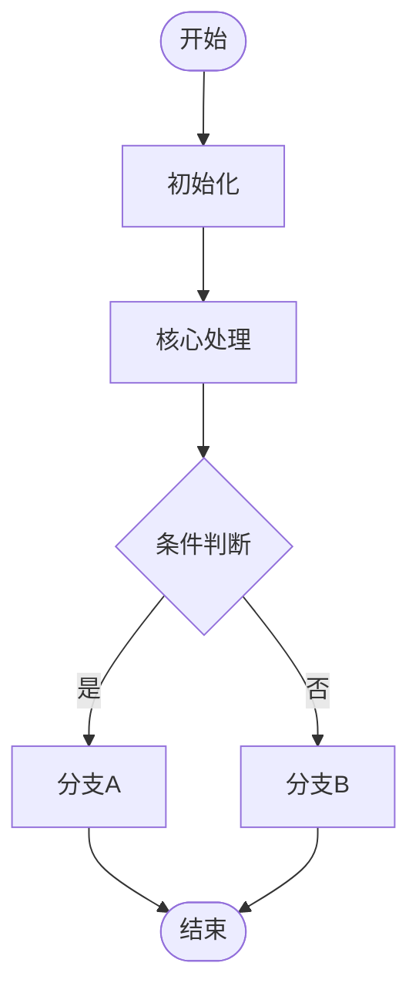
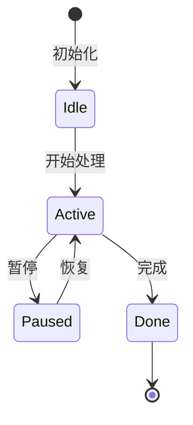
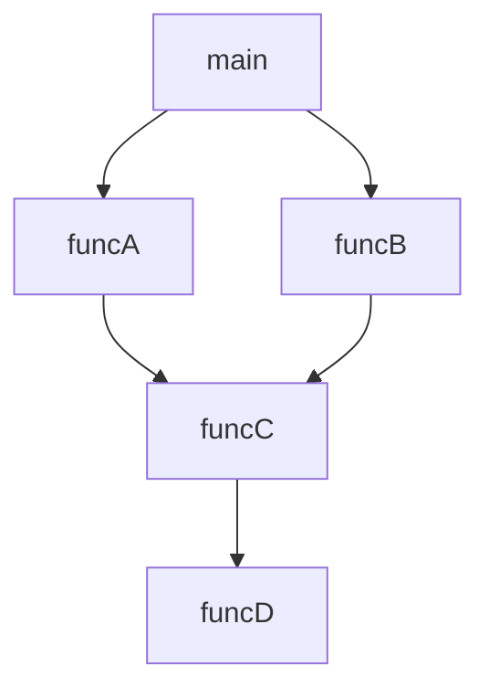

# 语义图谱 Semantic Atlas

<!-- 本文件由 atlas 子技能自动生成。LLM 读取源代码后填充以下 14 个 Section（Section 0–13）。
     优先级：图 > 表 > 文本。每个 Section 都有 <!-- placeholder: ... --> 注释说明 LLM 应该填充什么内容。 -->

---

## Section 0: 一屏摘要 Dashboard

<!-- placeholder: 填写一张总览表，每行对应一个源文件。按模块/目录分组。所有列必须填写，不允许空单元格。 -->

| 文件 | 语言 | 文件职责 | 核心输入 | 核心输出 | 关键状态 | 主要函数 | 状态复杂度 | 副作用复杂度 | 主要风险 | 需求符合性 | 最终风险等级 |
|------|------|----------|----------|----------|----------|----------|------------|------------|----------|------------|-------------|
| <!-- placeholder: 文件路径 --> | <!-- placeholder: 如 TypeScript/Python/Go --> | <!-- placeholder: 一句话职责 --> | <!-- placeholder: 接收什么数据 --> | <!-- placeholder: 产出什么数据 --> | <!-- placeholder: 维护哪些关键状态 --> | <!-- placeholder: 列出 2-5 个主要函数 --> | <!-- placeholder: 高/中/低 --> | <!-- placeholder: 高/中/低 --> | <!-- placeholder: 一句话风险 --> | <!-- placeholder: 完全符合/部分符合/不符 --> | <!-- placeholder: 高/中/低 --> |

<!-- placeholder: 可根据实际文件数量追加行 -->

---

## Section 1: 模块框架图

<!-- placeholder: 使用 Mermaid flowchart LR 绘制模块间依赖关系。
     节点为模块/目录，边为 import/调用/数据传递关系。
     每个节点标注核心职责。 -->

---

## Section 2: 核心执行流程图

<!-- placeholder: 使用 Mermaid flowchart TD 绘制主执行路径（happy path）。
     从入口函数开始，展示关键分支和循环。标注条件判断和异常路径。 -->

---

## Section 3: 数据流图

<!-- placeholder: 使用 Mermaid flowchart LR 绘制数据在各模块/函数之间的流转。
     节点为数据结构或变量，边标注数据变换操作。 -->

---

## Section 4: 状态机图

<!-- placeholder: 使用 Mermaid stateDiagram-v2 绘制关键状态机的状态转换。
     如果没有明显状态机则标注"本模块无明显状态机模式"。
     标注触发转换的事件/条件。 -->

---

## Section 5: 函数调用图

<!-- placeholder: 使用 Mermaid flowchart TD 绘制函数之间的调用关系。
     节点为函数名，边为调用方向。标注递归、回调、间接调用。 -->

---

## Section 6: 状态变量表

<!-- placeholder: 列出所有模块级/全局级/类级别的状态变量。
     如果没有状态变量则标注"无状态变量"。
     每个状态变量占一行，所有列必须填写。 -->

| 状态变量 | 类型 | 所属范围 | 含义 | 初始值 | 读取函数 | 修改函数 | 生命周期 | 风险 |
|----------|------|----------|------|--------|----------|----------|----------|------|
| <!-- placeholder: 变量名 --> | <!-- placeholder: 如 number/string/object --> | <!-- placeholder: 如 全局/模块/类实例 --> | <!-- placeholder: 一句话含义 --> | <!-- placeholder: 初始值 --> | <!-- placeholder: 哪些函数读取 --> | <!-- placeholder: 哪些函数修改 --> | <!-- placeholder: 如 应用生命周期/请求生命周期 --> | <!-- placeholder: 如 并发读写/未重置 --> |

<!-- placeholder: 可根据实际变量数量追加行 -->

---

## Section 7: 函数契约总表

<!-- placeholder: 列出所有公开函数和关键私有函数。
     每个函数占一行。"代码证据"列填写行号或代码片段锚点。
     "置信度"列为 LLM 对分析结果的自信程度：高/中/低。 -->

| 函数 | 类型 | 输入 | 输出 | 前置条件 | 读取状态 | 修改状态 | 副作用 | 失败/边界条件 | 代码证据 | 置信度 |
|------|------|------|------|----------|----------|----------|--------|--------------|----------|--------|
| <!-- placeholder: 函数名 --> | <!-- placeholder: 如 public/private/callback --> | <!-- placeholder: 参数列表 --> | <!-- placeholder: 返回值 --> | <!-- placeholder: 调用前必须满足的条件 --> | <!-- placeholder: 读取哪些状态变量 --> | <!-- placeholder: 修改哪些状态变量 --> | <!-- placeholder: 如 写文件/发请求/打印日志 --> | <!-- placeholder: 如 null输入/网络超时 --> | <!-- placeholder: 行号或关键代码 --> | <!-- placeholder: 高/中/低 --> |

<!-- placeholder: 可根据实际函数数量追加行 -->

---

## Section 8: 函数副作用矩阵

<!-- placeholder: 列出所有有副作用的函数。使用 ✓/✗ 标注每种副作用类型。
     如果函数无任何副作用则可省略（纯函数）。
     "备注"列填写补充说明。 -->

| 函数 | 修改对象状态 | 修改全局状态 | 文件I/O | 网络I/O | 硬件I/O | 日志 | 异常/错误码 | 调用其他函数 | 备注 |
|------|-------------|-------------|---------|---------|---------|------|------------|-------------|------|
| <!-- placeholder: 函数名 --> | <!-- placeholder: ✓/✗ --> | <!-- placeholder: ✓/✗ --> | <!-- placeholder: ✓/✗ --> | <!-- placeholder: ✓/✗ --> | <!-- placeholder: ✓/✗ --> | <!-- placeholder: ✓/✗ --> | <!-- placeholder: ✓/✗ --> | <!-- placeholder: 列出被调函数 --> | <!-- placeholder: 补充说明 --> |

<!-- placeholder: 可根据实际函数数量追加行 -->

---

## Section 9: 边界条件与风险矩阵

<!-- placeholder: 列出所有识别到的风险点和边界条件。
     按风险等级降序排列（高→中→低）。
     "是否阻塞"列标注该风险是否阻塞发布。 -->

| 风险点 | 涉及函数 | 风险等级 | 触发条件 | 当前代码行为 | 可能后果 | 建议测试 | 是否阻塞 |
|--------|----------|----------|----------|-------------|----------|----------|----------|
| <!-- placeholder: 如"空指针解引用" --> | <!-- placeholder: 涉及的函数名 --> | <!-- placeholder: 高/中/低 --> | <!-- placeholder: 如"输入为null时" --> | <!-- placeholder: 如"直接访问属性，无空检查" --> | <!-- placeholder: 如"运行时崩溃" --> | <!-- placeholder: 如"传入null验证异常处理" --> | <!-- placeholder: 是/否 --> |

<!-- placeholder: 可根据实际风险数量追加行 -->

---

## Section 10: 需求符合性矩阵

<!-- placeholder: 未提供需求文档时生成简化矩阵，基于代码推断的功能点验证。
     如果提供了需求文档，则逐条对照需求编号验证。 -->

| 需求/功能点 | 代码位置 | 符合程度 | 差距说明 |
|------------|----------|----------|----------|
| <!-- placeholder: 功能点描述 --> | <!-- placeholder: 对应的文件/函数/行号 --> | <!-- placeholder: 完全符合/部分符合/不符 --> | <!-- placeholder: 差距或缺失说明 --> |

<!-- placeholder: 可根据实际需求条目追加行 -->

---

## Section 11: 图表覆盖率矩阵

<!-- placeholder: 逐一检查每个代码元素（函数、状态、模块）在各图表中是否被覆盖。
     使用 ✓/✗ 标注。"是否完整覆盖"列汇总判断。
     目标：确保每个关键代码元素至少出现在 3 个图表/表中。 -->

| 代码元素 | 类型 | 状态表 | 函数表 | 调用图 | 流程图 | 状态机图 | 数据流图 | 副作用矩阵 | 风险矩阵 | 是否完整覆盖 |
|----------|------|--------|--------|--------|--------|----------|----------|------------|----------|-------------|
| <!-- placeholder: 元素名 --> | <!-- placeholder: 如 函数/状态/模块 --> | <!-- placeholder: ✓/✗ --> | <!-- placeholder: ✓/✗ --> | <!-- placeholder: ✓/✗ --> | <!-- placeholder: ✓/✗ --> | <!-- placeholder: ✓/✗ --> | <!-- placeholder: ✓/✗ --> | <!-- placeholder: ✓/✗ --> | <!-- placeholder: ✓/✗ --> | <!-- placeholder: 是/否 --> |

<!-- placeholder: 可根据实际代码元素数量追加行 -->

---

## Section 12: 代码反编译：自然语言伪代码

<!-- placeholder: 将每个核心函数的执行逻辑翻译为编号步骤的自然语言伪代码。
     每个函数一个子标题，步骤使用数字编号。
     格式示例：
     ### 函数名（参数列表）
     1. 检查前置条件 ...
     2. 初始化变量 ...
     3. 遍历集合，对每个元素执行 ...
     4. 处理异常情况 ...
     5. 返回结果 ...
-->

### <!-- placeholder: 函数名（参数列表）-->

1. <!-- placeholder: 步骤1 -->
2. <!-- placeholder: 步骤2 -->
3. <!-- placeholder: 步骤3 -->

<!-- placeholder: 可根据实际函数数量追加子节 -->

---

## Section 13: 最终审计结论

<!-- placeholder: 汇总所有分析结果，给出最终审计结论。
     "总体评估"为整体架构质量评价。
     "关键发现"列出最重要的 3-5 个发现。
     "建议行动"按优先级排列具体改进行动。 -->

| 维度 | 内容 |
|------|------|
| **总体评估** | <!-- placeholder: 一段话总结代码质量、架构合理性、风险水平 --> |
| **关键发现** | <!-- placeholder: 1. ... 2. ... 3. ... （列出 3-5 条） --> |
| **建议行动** | <!-- placeholder: 1. [高优先] ... 2. [中优先] ... 3. [低优先] ... --> |

---
